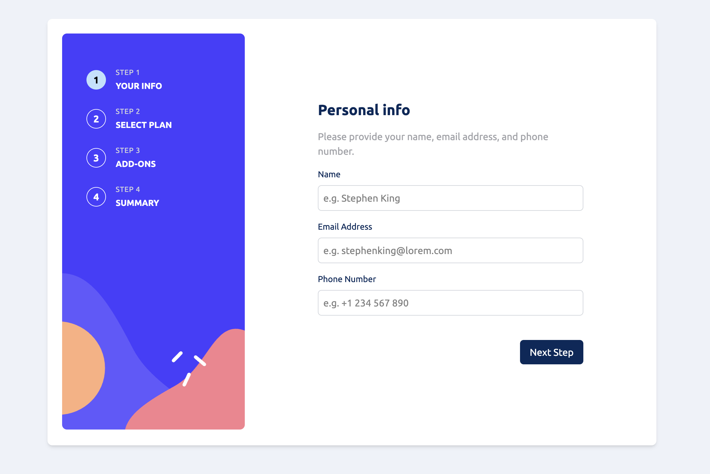
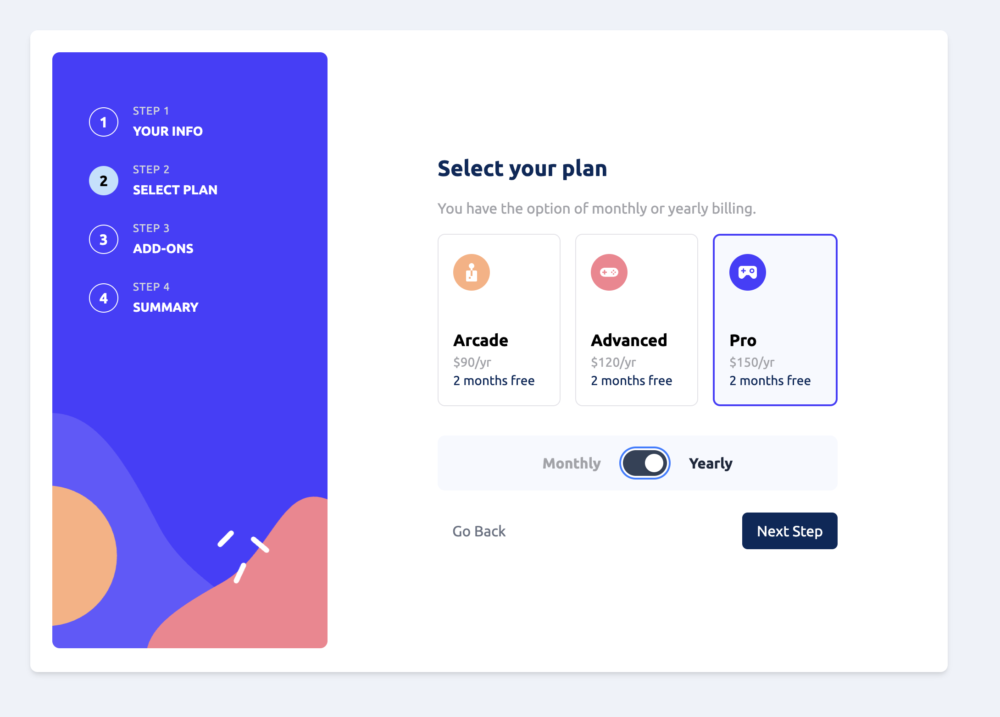

# Multi-Step Form

A responsive multi-step form application built with React and TypeScript, featuring a modern UI design with step-by-step navigation for collecting user information, plan selection, add-ons, and order summary.




## 🚀 Project Overview

This project is a comprehensive multi-step form that guides users through a subscription signup process. It includes:

- **Step 1: Personal Info** - Collect user's name, email, and phone number with real-time validation
- **Step 2: Select Plan** - Choose between different subscription plans (Arcade, Advanced, Pro) with monthly/yearly billing toggle
- **Step 3: Add-ons** - Select optional add-ons to enhance the subscription
- **Step 4: Summary** - Review all selections before confirmation
- **Step 5: Thank You** - Confirmation page after successful submission

## 🛠️ Technologies Used

### Core Technologies
- **React 19.1.0** - Modern React with latest features
- **TypeScript 5.8.3** - Type-safe JavaScript development
- **Vite 7.0.4** - Fast build tool and development server

### Styling & UI
- **Tailwind CSS 4.1.11** - Utility-first CSS framework for rapid UI development
- **Custom SVG Assets** - Background images and icons for enhanced visual design

### Development Tools
- **ESLint 9.30.1** - Code linting and quality enforcement
- **TypeScript ESLint 8.35.1** - TypeScript-specific linting rules
- **React Hooks ESLint Plugin** - React hooks best practices

### Build & Development
- **Vite React Plugin 4.6.0** - React support for Vite
- **TypeScript Compiler** - Type checking and compilation

## ✨ Key Features

- **Responsive Design** - Optimized for both mobile and desktop experiences
- **Form Validation** - Real-time validation with user-friendly error messages
- **State Management** - Efficient form state handling across multiple steps
- **Accessibility** - WCAG compliant with proper ARIA labels and keyboard navigation
- **Modern UI** - Clean, professional design with smooth transitions
- **Type Safety** - Full TypeScript implementation for robust development

## 🎨 Design Highlights

- **Mobile-First Approach** - Horizontal step navigation on mobile, sidebar navigation on desktop
- **Interactive Elements** - Custom styled checkboxes, toggles, and form controls
- **Visual Feedback** - Clear indication of current step and form validation states
- **Consistent Theming** - Cohesive color scheme and typography throughout

## 📱 Responsive Behavior

- **Mobile (< 768px)**: Horizontal step indicators at the top, stacked form layout
- **Desktop (≥ 768px)**: Vertical sidebar with step details, side-by-side layout with form content

## 🚦 Getting Started

```bash
# Install dependencies
npm install

# Start development server
npm run dev

# Build for production
npm run build

# Preview production build
npm run preview

# Run linting
npm run lint
```

## 📁 Project Structure

```
src/
├── components/           # Reusable React components
│   ├── PersonalInfo/    # Step 1 component
│   ├── TypeOfPlan/      # Step 2 component
│   ├── AddOns/          # Step 3 component
│   ├── Summary/         # Step 4 component
│   ├── ThankYou/        # Step 5 component
│   └── TopNavigation/   # Navigation component
├── assets/              # Static assets (images, icons)
├── data/                # Application data and configuration
└── App.tsx              # Main application component
```

## 🎯 Learning Objectives

This project demonstrates:
- Multi-step form implementation patterns
- State management across components
- Form validation techniques
- Responsive design with Tailwind CSS
- TypeScript integration in React applications
- Modern React development practices
- Accessibility considerations in web forms

### Automated tests
- configured an automated test with Stagehand
- used a README marked found at /automated-test/MULTI-STEP-FORM_monthly

---

Built with ❤️ by [HawiCaesar](https://github.com/HawiCaesar)